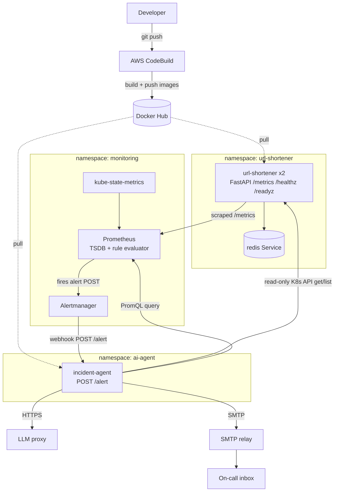
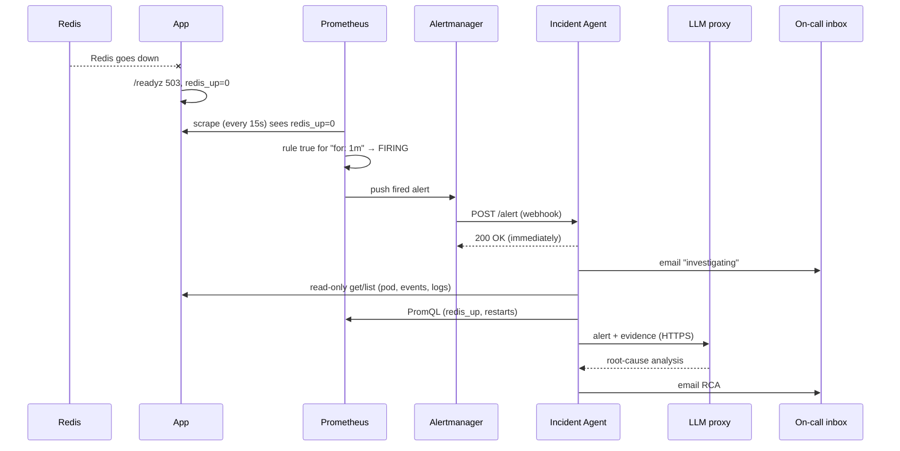

# AIOps Platform — Architecture & Component Insights

This document explains **what every component does**, **how they connect**, and **how the
networking, monitoring, alerting and AI pieces fit together**. It is the companion to the
line-by-line comments in the YAML manifests under `k8s/`.

---

## 1. What we are building (in one paragraph)

A small **URL shortener** (FastAPI + Redis) runs on Kubernetes as a realistic sample
workload. A **monitoring stack** (Prometheus + Alertmanager + kube-state-metrics) watches
it and fires alerts when something breaks. An **AI incident agent** receives those alerts,
gathers **read-only** evidence from the cluster and Prometheus, asks an **LLM** for a
root-cause analysis, and **emails** the report to on-call — with strict guardrails
(read-only RBAC, human-in-the-loop).

---

## 2. The three namespaces (isolation boundaries)

| Namespace       | Contains                                             | Purpose                              |
|-----------------|------------------------------------------------------|--------------------------------------|
| `url-shortener` | app pods (×2), Redis, ConfigMap                      | the workload being observed          |
| `monitoring`    | Prometheus, Alertmanager, kube-state-metrics         | observe → alert → route              |
| `ai-agent`      | incident-agent pod, read-only RBAC, config           | investigate & report                 |

Everything talks across namespaces using **Service DNS**, never IP addresses.

---

## 3. High-level architecture



---

## 4. Component-by-component insights

### 4.1 URL Shortener app (`k8s/app-deployment.yaml`, `k8s/app-service.yaml`)
- **What:** stateless FastAPI service, **2 replicas** for availability.
- **Key insight — probes:** `/healthz` (liveness) never touches Redis, so a Redis outage
  doesn't cause pod restarts. `/readyz` (readiness) returns **503** when Redis is down, so
  K8s stops routing traffic to a pod that can't serve — without killing it.
- **Key insight — discovery:** the pod carries `prometheus.io/scrape/port/path` annotations.
  That's the *entire* reason Prometheus finds it automatically.
- **Config injection:** `envFrom` pulls the whole ConfigMap in as environment variables, so
  the same image runs anywhere; only the config changes.

### 4.2 Redis (`k8s/redis.yaml`)
- **What:** single-replica data store (Deployment + Service).
- **Key insight — the DNS link:** the app's ConfigMap sets `REDIS_HOST: "redis"`, which
  resolves to **this Service's name**. That is how the app reaches Redis with zero hardcoded IPs.
- Liveness = TCP port open; readiness = `redis-cli ping` returns PONG.

### 4.3 ConfigMap (`k8s/configmap.yaml`)
- Non-secret config (Redis host/port, base URL, code length, log level).
- **Insight:** decouples configuration from the image (12-factor). This is also where you
  could inject a *bad* value to deliberately trigger an incident for the agent to diagnose.

### 4.4 kube-state-metrics (`k8s/monitoring/01-kube-state-metrics.yaml`)
- **What:** translates Kubernetes **object state** into metrics
  (`kube_pod_container_status_restarts_total`, `..._waiting_reason`,
  `..._last_terminated_reason`, `kube_pod_status_ready`).
- **Insight:** the app only knows about itself. KSM is what lets us alert on
  **CrashLoopBackOff, ImagePullBackOff, OOMKilled, NotReady** — signals that live in the
  K8s API, not in the app. Ships with its own **read-only** RBAC.

### 4.5 Prometheus (`02-prometheus-rbac`, `03-prometheus-config`, `04-prometheus-rules`, `05-prometheus-deployment`)
- **What:** the "brain". It does **three** jobs, not one:
  1. **Scrapes** `/metrics` from targets every 15s (pull) → stores in its **TSDB**.
  2. **Evaluates** alert rule expressions every 15s.
  3. **Pushes** fired alerts to Alertmanager.
- **Insight — service discovery:** `03` uses `kubernetes_sd_configs: role: pod` +
  `relabel_configs` to keep only annotated pods and rewrite the scrape address. It also
  copies `namespace` and `pod` onto every metric — which later become the alert labels the
  **agent uses to know what to investigate**.
- **Insight — RBAC:** `02` grants Prometheus read-only `get/list/watch` on pods/services/
  endpoints/nodes so discovery works.
- **Insight — alert states:** a rule goes `Inactive → Pending → Firing`; it only fires after
  its `for:` duration, which filters out momentary blips.

### 4.6 Alertmanager (`06-alertmanager-config`, `07-alertmanager-deployment`)
- **What:** the "mailroom". It **never** queries the TSDB. It only receives what Prometheus
  pushes, then **groups/deduplicates/routes**.
- **Insight:** its single receiver is a **webhook** pointing at the agent
  (`http://incident-agent.ai-agent.svc:8080/alert`). `send_resolved: true` also notifies
  when the problem clears. Swap the URL to `alert-receiver` (`08`) to just *see* raw payloads.

### 4.7 AI Incident Agent (`k8s/agent/*`)
- **What:** FastAPI service; on each firing alert it runs: **email → collect → LLM → email**.
- **Insight — the main guardrail (`01-rbac.yaml`):** the agent's ServiceAccount is bound to a
  **read-only** ClusterRole (`get/list` on pods, pods/log, events, deployments, nodes…).
  **Secrets are deliberately excluded.** Even a misbehaving model or an injected log line has
  no write/exec capability to abuse.
- **Insight — secrets split (`02-configmap.yaml` + Secret):** non-secret settings live in the
  ConfigMap; `LLM_API_KEY` and `SMTP_PASSWORD` live in a Secret created *imperatively*
  (see `SECRET_SETUP.md`) — never committed to git.
- **Insight — identity (`04-deployment.yaml`):** `serviceAccountName: incident-agent` is the
  line that actually attaches the read-only permissions to the pod. `envFrom` pulls in both
  the ConfigMap and the Secret.

---

## 5. Networking — how everything finds everything

### 5.1 Service DNS (the golden rule: names, not IPs)
Every Service is reachable at `<name>.<namespace>.svc`. Pods are disposable (random IPs);
Services are stable. The links used here:

| From → To                         | Address                                        |
|-----------------------------------|------------------------------------------------|
| app → Redis                       | `redis` (same namespace)                        |
| Prometheus → kube-state-metrics   | `kube-state-metrics.monitoring.svc:8080`        |
| Prometheus → Alertmanager         | `alertmanager.monitoring.svc:9093`              |
| Alertmanager → agent              | `incident-agent.ai-agent.svc:8080/alert`        |
| agent → Prometheus                | `prometheus.monitoring.svc:9090`                |

### 5.2 Ports (three numbers, don't confuse them)
- **containerPort** — where the process listens (app 8000, redis 6379, prom 9090, agent 8080).
- **Service port** — what the Service exposes (app Service uses 80).
- **targetPort** — which container port the Service forwards to (often by **name**, e.g. `http`).

Example: `url-shortener` Service `port 80 → targetPort http (8000)`.

### 5.3 Labels & selectors (the glue)
A Service routes to pods whose labels match its `selector`; a Deployment manages pods whose
labels match its `selector.matchLabels`. E.g. Service `redis` `selector: app=redis` → the
Redis pod labeled `app=redis`.

### 5.4 Egress to outside the cluster (SNAT)
The agent reaches the **LLM proxy** (HTTPS) and **SMTP relay** (port 25), both *outside* the
cluster. On egress, Kubernetes performs **SNAT** — traffic appears to come from the **node IP**.
That's why an internal relay that trusts the node accepts mail without extra auth.

### 5.5 Auth vs Authorization (a common interview trap)
- **Authentication** = *who am I*: the pod's mounted **ServiceAccount token**
  (`load_incluster_config()` in `collector.py`).
- **Authorization** = *what may I do*: **RBAC** (ClusterRole + Binding). The token identifies
  the agent; RBAC limits it to `get/list`.

---

## 6. The two end-to-end flows

### 6.1 A user shortens & visits a URL
1. `POST /shorten` → app Service (80) → a pod (8000).
2. App validates the URL, generates a unique code, `SET url:<code>` in Redis (`redis` DNS).
3. Returns JSON; middleware records metrics.
4. `GET /<code>` → app looks up Redis → `307` redirect (or 404).

### 6.2 An incident is detected & analysed


**Key correction to a common misunderstanding:** Prometheus (not Alertmanager) decides an
alert has fired and **pushes** it. Alertmanager only receives, groups, and routes.

---

## 7. Security & guardrails (the talking points)

- **Read-only RBAC** for the agent — no create/update/delete/exec, **no Secrets**.
- **LLM has no tools & no cluster access** — it only reasons over gathered text.
- **Human-in-the-loop** — remediations are *suggestions*, never executed.
- **Prompt-injection defense** — logs are treated as untrusted data; the system prompt
  forbids obeying instructions in evidence; and RBAC removes any dangerous capability anyway.
- **Secrets management** — tokens/passwords in a Secret, created imperatively, never in git.
- **Least privilege everywhere** — kube-state-metrics and Prometheus also run read-only.

---

## 8. Apply order (dependencies matter)

```bash
# 1) App workload
kubectl apply -f k8s/namespace.yaml
kubectl apply -f k8s/configmap.yaml
kubectl apply -f k8s/redis.yaml
kubectl apply -f k8s/app-deployment.yaml
kubectl apply -f k8s/app-service.yaml

# 2) Monitoring (numbered in dependency order)
kubectl apply -f k8s/monitoring/

# 3) Agent — create the Secret FIRST (see k8s/agent/SECRET_SETUP.md), then:
kubectl apply -f k8s/agent/00-namespace.yaml
kubectl apply -f k8s/agent/01-rbac.yaml
kubectl apply -f k8s/agent/02-configmap.yaml
# (create incident-agent-secrets imperatively here)
kubectl apply -f k8s/agent/04-deployment.yaml
```

> **Important:** never put an applyable Secret YAML in `k8s/agent/`. Applying the folder would
> overwrite the real Secret with a placeholder (this bug actually happened). Create the Secret
> with `kubectl create secret ...` per `SECRET_SETUP.md`.

---

## 9. File map (what each manifest is for)

| File                                          | Kind(s)                              | Role |
|-----------------------------------------------|--------------------------------------|------|
| `namespace.yaml`                              | Namespace                            | app boundary |
| `configmap.yaml`                              | ConfigMap                            | app non-secret config |
| `redis.yaml`                                  | Deployment + Service                 | data store + DNS name `redis` |
| `app-deployment.yaml`                         | Deployment                           | 2 app pods, probes, scrape annotations |
| `app-service.yaml`                            | Service                              | stable app address (80→8000) |
| `monitoring/00-namespace.yaml`                | Namespace                            | monitoring boundary |
| `monitoring/01-kube-state-metrics.yaml`       | SA + ClusterRole + Binding + Deploy + Svc | cluster-state metrics |
| `monitoring/02-prometheus-rbac.yaml`          | SA + ClusterRole + Binding           | Prometheus discovery permissions |
| `monitoring/03-prometheus-config.yaml`        | ConfigMap                            | scrape config + discovery |
| `monitoring/04-prometheus-rules.yaml`         | ConfigMap                            | the alert rules |
| `monitoring/05-prometheus-deployment.yaml`    | Deployment + Service                 | Prometheus itself (9090) |
| `monitoring/06-alertmanager-config.yaml`      | ConfigMap                            | routing → agent webhook |
| `monitoring/07-alertmanager-deployment.yaml`  | Deployment + Service                 | Alertmanager itself (9093) |
| `monitoring/08-alert-receiver.yaml`           | Deployment + Service                 | debug echo sink |
| `agent/00-namespace.yaml`                     | Namespace                            | agent boundary |
| `agent/01-rbac.yaml`                          | SA + ClusterRole + Binding           | **read-only guardrail** |
| `agent/02-configmap.yaml`                     | ConfigMap                            | agent non-secret config |
| `agent/04-deployment.yaml`                    | Deployment + Service                 | agent itself (8080) + webhook target |

---

## 10. Glossary (quick reference)

- **Pod** — smallest deployable unit; wraps containers (disposable, random IP).
- **Deployment** — keeps N identical pods running; self-heals; rolling updates.
- **Service** — stable DNS name + virtual IP in front of pods (ClusterIP = internal).
- **ConfigMap / Secret** — non-secret / secret config injected as env vars.
- **Label / Selector** — tags / queries that link Services↔Pods and Deployments↔Pods.
- **Probe** — liveness (alive? → restart) vs readiness (can serve? → route/no-route).
- **RBAC** — ServiceAccount (identity) + ClusterRole (permissions) + Binding (the link).
- **Scrape** — Prometheus pulling `/metrics` from a target.
- **PromQL** — Prometheus query language (`redis_up == 0`, `rate(...)`).
- **SNAT** — pod egress appears to come from the node IP.
